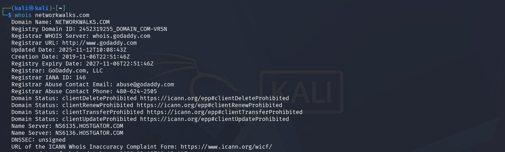
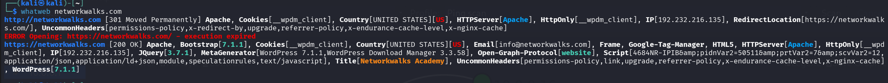
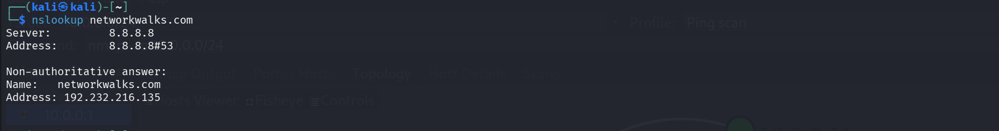
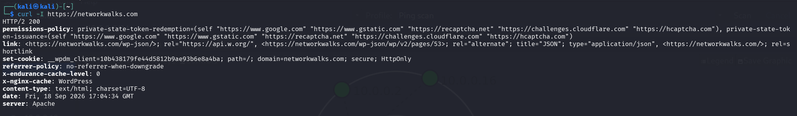
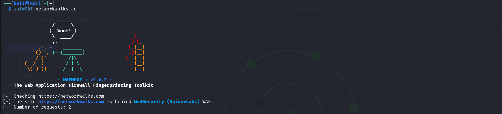
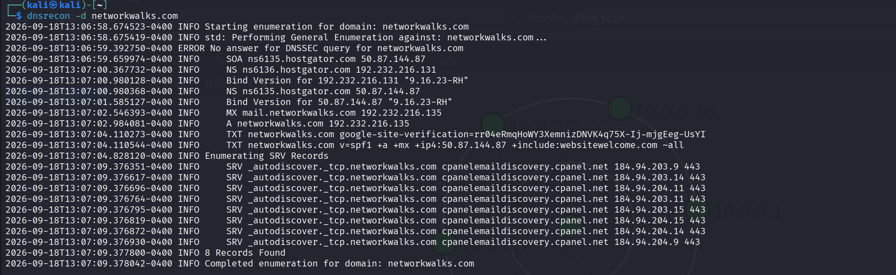
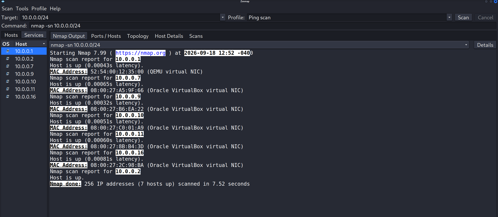
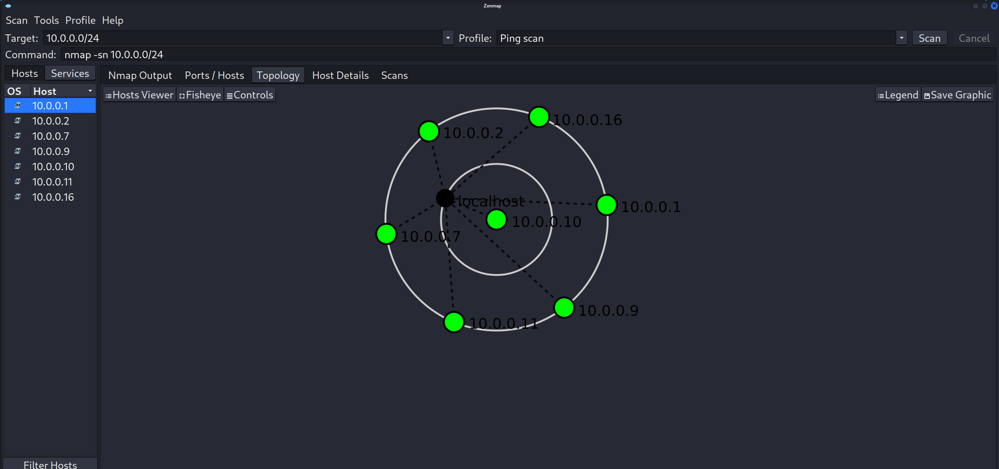

# 🔐 FOOTPRINTING & NETWORK SCANNING PHASES 

**W2-PM-FINAL | CYBERSECURITY |  NETWORKWALKS**

  
  
  
  
  
  
  
  
  
  
  
  

---

| Field | Detail |
|---|---|
| **Pentester Name (Cybersecurity Professional)** | **Mustafa Hagibrahim** |
| **Program/Batch** | B083-Networkwalks |
| **Date** | 18 September 2026 |
| **Modules completed** | W2-PM1 (Multiple Kali Tools) W2-PM5 (Zenmap Scanning) |
| **Client/Target** | 1. Networkwalks (secured written permission already) 2. My own local LAN Network |
| **Permission secured from client?** | Yes |
| **Phases covered** | **Phase 1:** Reconnaissance & Footprinting **Phase 2:** Scanning & Network Discovery **Phase 3-5:** In Progress |

# 1. Liability Disclaimer

I have performed these activities only on the systems & devices where I had secured written permission or the devices/systems that I own myself. All these materials are for education and research purpose only. Do not use anything from here to break the law. The instructor, the authors and Networkwalks are not responsible for what you do with this knowledge. Every action you take is your own responsibility. Misuse can lead to criminal charges, heavy fines, loss of your job and a permanent record. In most countries unauthorised access is a crime even when nothing is damaged.

# 2. Introduction

This si a report on the footprinting anf Network scanning phase on the networkwalks.com doamin and on the local network of my own lab. & tools that has been used in these two phases

this week 2 of my internship at `networkwalks`.

# 3. Tools Used

The table below lists each tool used in this report and its purpose.

| Tool | Purpose |
|---|---|
| Kali Linux & Windows | Operating systems used for reconnaissance activities             |
| WHOIS                | Find domain registration details (owner, dates, name servers).   |
| whatweb              | Fingerprint web technologies (server, CMS, plugins, IP).         |
| nslookup             | Resolve the domain name to its IP address using DNS.             |
| curl                 | Read the HTTP response headers of the website.                   |
| wafw00f              | Detect whether a Web Application Firewall protects the site.     |
| dnsrecon             | Enumerate all DNS records (NS, MX, SPF, TXT, SRV).               |
| Zenmap (Nmap GUI)    | Scan the local subnet to find live hosts, IPs and MAC addresses. |
| Windows CMD          | Local IP and MAC address identification                          |

# 4. Activities Performed

## 4.1 Footprinting & Reconnaissance

I used 6 tools for footprinting and reconnaossance : `whatweb`, `whois`, `nslookup`, `curl`, `wafw00f`, `dnsrecon`.

First tool is `whois` this gave publicly available domain inforamtion about doamin. It reveals the registrar, registration and expiry dates, and name servers.

Then the second tool is `whatweb`. It give the Information about the exact softwares which have been used to make the website.we Identify that it runnign `Bootstrap[7.1.1], JQuery[3.7.1], WordPress[7.1.1] ,WordPress Download Manager[3.3.58]`

After that we have `nslookup`. It show us the IP address of the domain `networkwalks.com` which is `192.232.216.135`

Then firing the curl command to inspect the headers of the http request. It also let us identify the softwares that behind the webserver like `whatweb`. Here we also know that this webiste is running `Wordpress`. Also we Identify the folder `wp-json/`.
Also, it is importnat to  identify if there any WAF application that protoect the webserver, and with the help of `wafw00f`. The Identify WAF is `ModSecurity (SpiderLabs)`.

Lastly, The tool 'dnsrecon' that give us dns record that is mapped to our domain `networkwalks.com` from IPs to mail server and main doamin server with version.we identify the version and emails of the `networkwalks.com`
email server : `mail.networkwalks.com 192.232.216.135`, SOA or main domain server : `ns6135.hostgator.com 50.87.144.87`

## 4.2 Network Scanning with Zenmap

Next part is Netwrok scanning we will used `Zenmap` to scan our local network that has been set up on the previuos week for cybersecuorty lab.

So I know alred that my local host netkork is `10.0.0.0/24` so I used zenmap to scan the whole netwrok and Identify live host, it came with live host machine, I went to tobology and saved it as pdf  

>[!Note] It is important for enable ICMP echo replay in windows machines

# 5. Risk Analysis / Impact

Based on the information collected during the footprinting and network scanning activities, I identified the following potential risks.

| **\#** | **Risk / Finding**                           | **Evidence / Observation**                                  | **Potential Impact**                                                                                            | **Risk Level** |
|--------|----------------------------------------------|-------------------------------------------------------------|-----------------------------------------------------------------------------------------------------------------|----------------|
| 1      | Web technology information exposed           | WhatWeb identified WordPress and WP Download Manager        | Attackers may use exposed technology/version information to identify software requiring further security review | **● Medium**   |
| 2      | Server IP address identifiable               | Nslookup resolved the domain to `192.232.216.135`           | Provides information about the network location of the web service                                              | **● Low**      |
| 3      | HTTP technical information exposed           | Curl returned HTTP response headers and exposed `/wp-json/` | May assist technology fingerprinting and further enumeration                                                    | **● Low**      |
| 4      | WAF technology identifiable                  | Wafw00f identified ModSecurity (SpiderLabs)                 | Reveals information about the web application’s security architecture                                           | **● Low**      |
| 5      | DNS infrastructure information exposed       | DNSRecon identified DNS, mail and service-related records   | DNS information can help build a broader infrastructure profile                                                 | **● Medium**   |
| 6      | Multiple live hosts visible on local network | Zenmap identified four live hosts in the example network    | Unknown or unauthorized devices may potentially be present on a network                                         | **● Medium**   |

**Risk level key:** ● Critical ● Medium ● Low

The risks above are observations from the footprinting and scanning exercises, not confirmed vulnerabilities.

The practical exercises primarily involved information gathering and host discovery. No exploitation or vulnerability validation was performed as part of these two modules.

Therefore, the presence of information such as a software version, IP address or DNS record does not by itself mean that the system is vulnerable. Further authorized security testing would be required to confirm any actual vulnerability.

# 6. Recommendations

Based on the observations from these activities, I recommend the following security improvements:

1.  **Review publicly exposed technology information**  
    Organizations should regularly review what information about their web technologies, CMS and plugins is publicly visible.

2.  **Keep software updated**  
    CMS platforms, plugins and other web technologies should be regularly updated and reviewed against current security advisories.

3.  **Review HTTP headers**  
    HTTP response headers should be reviewed to determine whether unnecessary technical information is being exposed.

4.  **Review DNS records regularly**  
    DNS records should be checked periodically to ensure that only required information and services are publicly exposed.

5.  **Properly configure and monitor the WAF**  
    Keep the WAF (ModSecurity) enabled and tuned, since it already blocks naive attacks.

6.  **Perform regular internal network discovery**  
    Organizations should periodically scan their own networks to identify active devices.

7.  **Investigate unknown devices**  
    Any unexpected device discovered during network scanning should be investigated and verified.

8.  **Maintain network documentation**  
    Network topology and device information should be documented and updated regularly.

9.  **Perform security testing with authorization**  
    Reconnaissance and scanning should only be performed against systems and networks where appropriate authorization has been provided.

# 7. Conclusion

During Week 2 of my Cybersecurity & Ethical Hacking internship, I completed practical activities covering footprinting, reconnaissance and network scanning.

By using the 6 tools I Identify how Footprinting can be conduct and why is very imortant in pentesting phase 

Also by using zenmap I learnd How to idnetify live host.

Lastly I learnd how to documnets and make a powerfull report that can deliver important to the customers.

# 8. Evidences Collected

*Screenshots collected as evidence during the activities (stored in the `screenshots/` folder):*

#  Author

**Mustafa Hagibrahim**\
Cybersecurity Professional B083

LinkedIn: [https://www.linkedin.com/in/waqaskarim/](https://www.linkedin.com/in/waqaskarim/)

##  Project Information

**Program Name:** Cybersecurity at Networkwalks | **Week:** 02 | **Project:** FOOTPRINTING & NETWORK SCANNING PHASES | **Repository:** GitHub